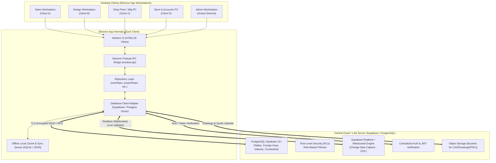

# RUNO HRS INDIA - Central Database Architecture Blueprint (Supabase / PostgreSQL)

**Document Version:** 1.0.0  
**Author:** Antigravity Engineering  
**Target:** Transition from Single-Machine Local JSON to Centralized Multi-User Cloud/LAN PostgreSQL Database (Supabase)  
**Date:** September 2026  

---

## 1. Executive Summary & Problem Statement

### 1.1 Current Architecture (Local Single-Node)
Abhi RUNO HRS MIS application ek **Single-User Desktop Application** ki tarah kaam karta hai:
- Data local file system par `runo_mis_database.json` me store hota hai (`StorageManager`).
- Agar 2 ya zyada computers (e.g. Design station, Shop floor manufacturing tablet, Sales laptop, Accounts PC) par application chale, toh sabka data alag-alag local file me rehta hai. Real-time sharing ya central source of truth nahi hai.

### 1.2 Future State Vision (Centralized Multi-User Cloud / LAN)
Central Database integrate hone ke baad:
1. **Single Source of Truth:** Sabhi computers (Sales, Design, Manufacturing, Accounts, Store, Admin) ek hi live database se judenge.
2. **Real-Time Collaboration:** Jaise hi Sales naya project add karega, Design team ke screen par bina page reload kiye instant popup aur notification aayega. Jaise hi Design drawing upload/check karega, Manufacturing team ka stage unlock ho jayega.
3. **Data Security & RBAC:** Role-Based Access Control (RBAC) aur PostgreSQL Row-Level Security (RLS) se sensitive costing/accounts data sirf authorized roles ko hi visible hoga.
4. **Offline Resilience (Hybrid Mode):** Factory me internet drop hone par local cache chalega aur internet aate hi changes auto-sync ho jayenge.

---

## 2. High-Level System Architecture



---

## 3. Why Supabase / PostgreSQL?

| Feature | Local JSON (Abhi) | Direct PostgreSQL (Self-Hosted) | Supabase (PostgreSQL Managed) |
| :--- | :--- | :--- | :--- |
| **Multi-User Concurrency** | ❌ File write locks / Data overwrites | ✅ ACID Transactions | ✅ ACID Transactions |
| **Real-time Live Sync** | ❌ None | ⚠️ Manual WebSocket server ya LISTEN/NOTIFY | ✅ Built-in WebSockets (Instant updates) |
| **User Authentication** | ⚠️ Plaintext JSON password check | ⚠️ Manual JWT / Bcrypt backend | ✅ Built-in Enterprise Auth + Sessions |
| **File / CAD Storage** | ⚠️ Local filesystem path | ⚠️ Separate file server setup | ✅ Built-in Storage Buckets (S3 compatible) |
| **Deployment Complexity** | Zero (Client only) | High (Requires DB Admin, Firewall, Port Forwarding) | Low (1-Click Cloud or Local Docker) |
| **Backup & Disaster Recovery** | Manual file copy | Cron jobs / pg_dump | ✅ Automated Daily Cloud Backups & Point-in-Time Restore |

---

## 4. PostgreSQL Relational Database Schema (DDL)

Neeche poora production-grade SQL DDL schema hai jo RUNO HRS ke saare modules ko cover karta hai:

```sql
-- ============================================================================
-- RUNO HRS INDIA - PRODUCTION POSTGRESQL SCHEMA (SUPABASE COMPATIBLE)
-- ============================================================================

CREATE EXTENSION IF NOT EXISTS "uuid-ossp";

-- 1. USERS & RBAC TABLE
CREATE TABLE users (
    id UUID PRIMARY KEY DEFAULT uuid_generate_v4(),
    username VARCHAR(50) UNIQUE NOT NULL,
    name VARCHAR(100) NOT NULL,
    email VARCHAR(150) UNIQUE,
    phone VARCHAR(20),
    role VARCHAR(30) NOT NULL CHECK (role IN ('ADMIN', 'SALES', 'DESIGN', 'MANUFACTURING', 'STORE', 'ACCOUNTS', 'QUALITY')),
    department VARCHAR(50),
    designation VARCHAR(50),
    password_hash VARCHAR(255) NOT NULL,
    status VARCHAR(20) DEFAULT 'PENDING_APPROVAL' CHECK (status IN ('APPROVED', 'PENDING_APPROVAL', 'REJECTED', 'SUSPENDED')),
    is_approved BOOLEAN DEFAULT FALSE,
    created_at TIMESTAMPTZ DEFAULT NOW(),
    updated_at TIMESTAMPTZ DEFAULT NOW()
);

-- 2. CUSTOMERS TABLE
CREATE TABLE customers (
    id UUID PRIMARY KEY DEFAULT uuid_generate_v4(),
    customer_code VARCHAR(50) UNIQUE NOT NULL,
    company_name VARCHAR(200) NOT NULL,
    contact_person VARCHAR(100),
    designation VARCHAR(100),
    phone VARCHAR(20),
    email VARCHAR(150),
    gstin VARCHAR(20),
    pan VARCHAR(20),
    industry VARCHAR(100) DEFAULT 'Automotive Lighting & Plastics',
    tier VARCHAR(50) DEFAULT 'Tier-1 OEM Supplier',
    payment_terms VARCHAR(50) DEFAULT '30 Days Net',
    address TEXT,
    city VARCHAR(100),
    state VARCHAR(100),
    city_state VARCHAR(200),
    pincode VARCHAR(20),
    section VARCHAR(30) DEFAULT 'HRS',
    created_at TIMESTAMPTZ DEFAULT NOW(),
    updated_at TIMESTAMPTZ DEFAULT NOW()
);

-- 3. PROJECTS TABLE (MASTER LIFECYCLE)
CREATE TABLE projects (
    id UUID PRIMARY KEY DEFAULT uuid_generate_v4(),
    project_code VARCHAR(50) UNIQUE NOT NULL,
    customer_id UUID REFERENCES customers(id) ON DELETE SET NULL,
    customer_name VARCHAR(200) NOT NULL,
    mould_description TEXT,
    category VARCHAR(30) DEFAULT 'HRS' CHECK (category IN ('HRS', 'HRTC', 'SPARE-HRS', 'SPARE-HRTC')),
    quote_status VARCHAR(30) DEFAULT 'PENDING' CHECK (quote_status IN ('PENDING', 'SENT', 'APPROVED', 'REJECTED', 'NEGOTIATION')),
    po_received VARCHAR(10) DEFAULT 'NO' CHECK (po_received IN ('YES', 'NO', 'PENDING')),
    
    -- Technical Specs
    nozzle_count INT DEFAULT 1,
    nozzle_type VARCHAR(100) DEFAULT 'Valve Gate Pneumatic',
    manifold_type VARCHAR(100) DEFAULT 'Balanced Manifold H13',
    runner_diameter VARCHAR(50) DEFAULT '12 mm',
    gate_type VARCHAR(100) DEFAULT 'Valve Gate 2.5mm',
    plastic_grade VARCHAR(100) DEFAULT 'Polycarbonate (PC)',
    material VARCHAR(100) DEFAULT 'Polycarbonate (PC)',
    shot_weight VARCHAR(50),
    part_weight VARCHAR(50),
    color_change VARCHAR(10) DEFAULT 'NO',
    mould_type VARCHAR(50) DEFAULT 'NEW MOULD',
    hrs_type VARCHAR(100) DEFAULT 'VALVE - RUNNER',
    nozzle_series VARCHAR(50) DEFAULT 'Series 16',
    connector VARCHAR(100) DEFAULT '16-Pin Heavy Duty',
    gate_dia VARCHAR(50) DEFAULT '2.5 mm',
    guide_dia VARCHAR(50) DEFAULT '6.0 mm',
    
    -- Commercial & Tracking
    value VARCHAR(50) DEFAULT '₹ 0',
    cost NUMERIC(12, 2) DEFAULT 0.00,
    id_card_no VARCHAR(50),
    status VARCHAR(30) DEFAULT 'ACTIVE' CHECK (status IN ('ACTIVE', 'COMPLETED', 'ON_HOLD', 'CANCELLED')),
    priority VARCHAR(20) DEFAULT 'MEDIUM',
    design_check VARCHAR(30) DEFAULT 'NOT CHECKED',
    
    -- Dates & Owners
    year VARCHAR(10),
    year_month VARCHAR(20),
    order_date DATE DEFAULT CURRENT_DATE,
    target_date DATE,
    owner VARCHAR(100) DEFAULT 'VIKRAM',
    project_manager VARCHAR(100) DEFAULT 'Anand Sharma',
    lead_engineer VARCHAR(100) DEFAULT 'Vikram Singh',
    created_by VARCHAR(50) DEFAULT 'SALES',
    notes TEXT,
    remark TEXT,
    created_at TIMESTAMPTZ DEFAULT NOW(),
    updated_at TIMESTAMPTZ DEFAULT NOW()
);

-- 4. PROJECT WORKFLOWS (2D/3D DESIGN MILESTONES)
CREATE TABLE project_workflows (
    id UUID PRIMARY KEY DEFAULT uuid_generate_v4(),
    project_id UUID UNIQUE REFERENCES projects(id) ON DELETE CASCADE,
    step_2d_start VARCHAR(50) DEFAULT '-',
    step_2d_end VARCHAR(50) DEFAULT '-',
    step_3d_start VARCHAR(50) DEFAULT '-',
    step_3d_end VARCHAR(50) DEFAULT '-',
    step_design_send VARCHAR(50) DEFAULT '-',
    updated_at TIMESTAMPTZ DEFAULT NOW()
);

-- 5. MANUFACTURING JOBS & STAGES
CREATE TABLE manufacturing_jobs (
    id UUID PRIMARY KEY DEFAULT uuid_generate_v4(),
    project_id UUID UNIQUE REFERENCES projects(id) ON DELETE CASCADE,
    current_stage VARCHAR(50) DEFAULT 'design_cad',
    overall_progress INT DEFAULT 0 CHECK (overall_progress BETWEEN 0 AND 100),
    stages JSONB DEFAULT '{
        "design_cad": {"status": "PENDING", "notes": "", "completed_date": null},
        "cnc_machining": {"status": "PENDING", "notes": "", "completed_date": null},
        "gun_drilling": {"status": "PENDING", "notes": "", "completed_date": null},
        "hardening": {"status": "PENDING", "notes": "", "completed_date": null},
        "assembly": {"status": "PENDING", "notes": "", "completed_date": null},
        "wiring_testing": {"status": "PENDING", "notes": "", "completed_date": null},
        "final_inspection": {"status": "PENDING", "notes": "", "completed_date": null}
    }'::jsonb,
    created_at TIMESTAMPTZ DEFAULT NOW(),
    updated_at TIMESTAMPTZ DEFAULT NOW()
);

-- 6. APPROVALS TABLE
CREATE TABLE approvals (
    id UUID PRIMARY KEY DEFAULT uuid_generate_v4(),
    project_id UUID REFERENCES projects(id) ON DELETE CASCADE,
    project_code VARCHAR(50) NOT NULL,
    type VARCHAR(50) DEFAULT 'DESIGN_DRAWING',
    title VARCHAR(200) NOT NULL,
    status VARCHAR(30) DEFAULT 'PENDING' CHECK (status IN ('PENDING', 'APPROVED', 'REJECTED')),
    requested_by VARCHAR(100),
    approved_by VARCHAR(100),
    approval_date TIMESTAMPTZ,
    remarks TEXT,
    created_at TIMESTAMPTZ DEFAULT NOW()
);

-- 7. PURCHASE REQUESTS & ITEMS
CREATE TABLE purchase_requests (
    id UUID PRIMARY KEY DEFAULT uuid_generate_v4(),
    sr SERIAL,
    pr_no VARCHAR(50) UNIQUE NOT NULL,
    project_code VARCHAR(50),
    project_desc TEXT,
    date DATE DEFAULT CURRENT_DATE,
    required_date DATE,
    category VARCHAR(50) DEFAULT 'HRS',
    item_desc TEXT,
    vendor VARCHAR(200),
    status VARCHAR(30) DEFAULT 'Pending' CHECK (status IN ('Pending', 'Quotation Received', 'PO Released', 'In Transit', 'Received', 'Cancelled')),
    priority VARCHAR(20) DEFAULT 'Normal',
    requested_by VARCHAR(100),
    purpose TEXT,
    internal_remarks TEXT,
    items JSONB DEFAULT '[]'::jsonb,
    attachments JSONB DEFAULT '[]'::jsonb,
    created_at TIMESTAMPTZ DEFAULT NOW(),
    updated_at TIMESTAMPTZ DEFAULT NOW()
);

-- 8. STORE ITEMS (INVENTORY & GODOWNS)
CREATE TABLE store_items (
    id UUID PRIMARY KEY DEFAULT uuid_generate_v4(),
    code VARCHAR(50) UNIQUE NOT NULL,
    name VARCHAR(200) NOT NULL,
    category VARCHAR(50) DEFAULT 'GENERAL',
    unit VARCHAR(20) DEFAULT 'NOS',
    min_stock NUMERIC(10, 2) DEFAULT 0,
    max_stock NUMERIC(10, 2) DEFAULT 0,
    location VARCHAR(100),
    active VARCHAR(10) DEFAULT 'YES',
    created_at TIMESTAMPTZ DEFAULT NOW(),
    updated_at TIMESTAMPTZ DEFAULT NOW()
);

-- 9. STORE TRANSACTIONS (STOCK LEDGER)
CREATE TABLE store_transactions (
    id UUID PRIMARY KEY DEFAULT uuid_generate_v4(),
    ref_no VARCHAR(50) NOT NULL,
    date DATE DEFAULT CURRENT_DATE,
    item_code VARCHAR(50) REFERENCES store_items(code) ON DELETE CASCADE,
    item_name VARCHAR(200),
    party_or_dept VARCHAR(100),
    qty NUMERIC(10, 2) NOT NULL,
    unit VARCHAR(20) DEFAULT 'NOS',
    location VARCHAR(100),
    tab_type VARCHAR(50) NOT NULL CHECK (tab_type IN ('STOCK IN', 'STOCK OUT', 'MATERIAL ISSUE', 'PURCHASE RECEIPT', 'OPENING STOCK', 'RETURN')),
    status VARCHAR(30) DEFAULT 'POSTED',
    created_at TIMESTAMPTZ DEFAULT NOW()
);

-- 10. ACCOUNTS ENTRIES (TALLY-STYLE DOUBLE-ENTRY)
CREATE TABLE account_entries (
    id UUID PRIMARY KEY DEFAULT uuid_generate_v4(),
    ref_no VARCHAR(50) NOT NULL,
    date DATE DEFAULT CURRENT_DATE,
    tab_type VARCHAR(50) NOT NULL CHECK (tab_type IN ('SALES', 'PURCHASE', 'RECEIPT', 'PAYMENT', 'CONTRA', 'JOURNAL', 'CREDIT NOTE', 'DEBIT NOTE')),
    particulars TEXT NOT NULL,
    debit NUMERIC(14, 2) DEFAULT 0.00,
    credit NUMERIC(14, 2) DEFAULT 0.00,
    amount NUMERIC(14, 2) NOT NULL,
    status VARCHAR(30) DEFAULT 'POSTED',
    created_at TIMESTAMPTZ DEFAULT NOW()
);

-- INDEXES FOR FAST QUERYING
CREATE INDEX idx_projects_code ON projects(project_code);
CREATE INDEX idx_projects_order_date ON projects(order_date);
CREATE INDEX idx_projects_status ON projects(status);
CREATE INDEX idx_projects_category ON projects(category);
CREATE INDEX idx_customers_code ON customers(customer_code);
CREATE INDEX idx_store_tx_item_code ON store_transactions(item_code);
CREATE INDEX idx_store_tx_date ON store_transactions(date);
CREATE INDEX idx_accounts_date ON account_entries(date);
```

---

## 5. Architectural Implementation in RUNO HRS

Hamare application ka design already **Repository Pattern** use karta hai:
`Frontend (Views)` -> `IPC Bridge (window.api)` -> `DatabaseCoordinator` -> `Domain Repositories (projectRepo, etc.)` -> `Storage`.

Iska sabse bada faayda ye hai ki **Frontend UI code ko ek line bhi change karne ki zaroorat nahi padegi!**
Sirf `db/` layer me `DatabaseAdapter` switch hoga.

### 5.1 The Adapter Pattern Interface

```javascript
// db/adapters/databaseAdapter.js
class DatabaseAdapter {
  async getAllProjects(filters) { throw new Error("Method not implemented"); }
  async getProjectById(id) { throw new Error("Method not implemented"); }
  async createProject(data) { throw new Error("Method not implemented"); }
  async updateProject(id, updates) { throw new Error("Method not implemented"); }
  async deleteProject(id) { throw new Error("Method not implemented"); }
  // ... baaki repos ke methods
}
```

### 5.2 Supabase Client Adapter Implementation

```javascript
// db/adapters/supabaseAdapter.js
const { createClient } = require('@supabase/supabase-js');

class SupabaseAdapter {
  constructor(supabaseUrl, supabaseAnonKey) {
    this.client = createClient(supabaseUrl, supabaseAnonKey, {
      auth: { persistSession: true },
      realtime: { params: { eventsPerSecond: 10 } }
    });
  }

  async getAllProjects(filters = {}) {
    let query = this.client.from('projects').select('*, customers(*)');

    if (filters.startDate && filters.endDate) {
      query = query.gte('order_date', filters.startDate).lte('order_date', filters.endDate);
    }
    if (filters.status && filters.status !== 'ALL') {
      query = query.eq('status', filters.status);
    }
    if (filters.category && filters.category !== 'ALL') {
      query = query.eq('category', filters.category);
    }
    if (filters.search) {
      query = query.ilike('project_code', `%${filters.search}%`);
    }

    const { data, error } = await query.order('created_at', { ascending: false });
    if (error) throw error;
    return data;
  }

  async createProject(projectData) {
    const { data, error } = await this.client
      .from('projects')
      .insert([projectData])
      .select()
      .single();

    if (error) throw error;
    return { success: true, project: data };
  }

  // Realtime subscription setup
  subscribeToChanges(table, callback) {
    return this.client
      .channel(`public:${table}`)
      .on('postgres_changes', { event: '*', schema: 'public', table }, payload => {
        callback(payload);
      })
      .subscribe();
  }
}

module.exports = SupabaseAdapter;
```

---

## 6. Real-Time Broadcast & Multi-Client Sync

Jab multiple computers connected honge:
1. Client 1 (Sales) new project banata hai.
2. Supabase Realtime channel `projects` table ka `INSERT` event broadcast karta hai.
3. Electron Main Process event receive karke sabhi open windows ko IPC ke zariye notify karta hai:
   `mainWindow.webContents.send('event:data-updated', { table: 'projects', action: 'INSERT' });`
4. Frontend bina reload huye naya row table me highlight karke dikha deta hai!

---

## 7. Migration Roadmap (Phase-by-Phase Plan)

### **Phase 1: Environment & Schema Setup (Day 1 - 2)**
- [ ] Supabase Cloud account create karna ya local Docker me PostgreSQL setup karna.
- [ ] DDL Schema execute karke tables, indexes aur constraints create karna.
- [ ] `.env` file configure karna (`SUPABASE_URL`, `SUPABASE_KEY`, `DB_MODE=SUPABASE`).

### **Phase 2: One-Click Data Migration Tool (Day 3)**
- [ ] Migration script likhna (`scripts/migrate-json-to-supabase.js`).
- [ ] Existing `runo_mis_database.json` se saare users, customers, projects, store items, account entries ko read karke Supabase me bulk upload karna.

### **Phase 3: Database Coordinator Adapter Hook (Day 4 - 6)**
- [ ] `db/index.js` ko update karna taaki agar `.env` me `DB_MODE=SUPABASE` ho toh SupabaseAdapter use kare, nahi toh local JSON fallback use kare.
- [ ] IPC handlers ko `async/await` promise compatible banana.

### **Phase 4: Realtime Subscriptions & Multi-User Verification (Day 7 - 8)**
- [ ] Realtime channels subscribe karna (Projects, Approvals, Purchase, Inventory).
- [ ] 2 computers par ek saath test karna — ek par project add ho aur dusre par live dikhe.

### **Phase 5: Offline Fallback & Package Build (Day 9 - 10)**
- [ ] Network disconnect handling (Agar internet jaye toh app crash na ho aur cached data dikhaye).
- [ ] Production build generate karna (`npm run build:exe`).

---

## 8. Summary Checklist
- [x] Zero breaking UI changes (Repositories aur IPC bridge untouched rahenge).
- [x] Full ACID relational schema ready with PostgreSQL DDL.
- [x] Multi-user realtime notifications through WebSockets.
- [x] Dual-mode compatibility (Offline Local JSON + Central Supabase).
