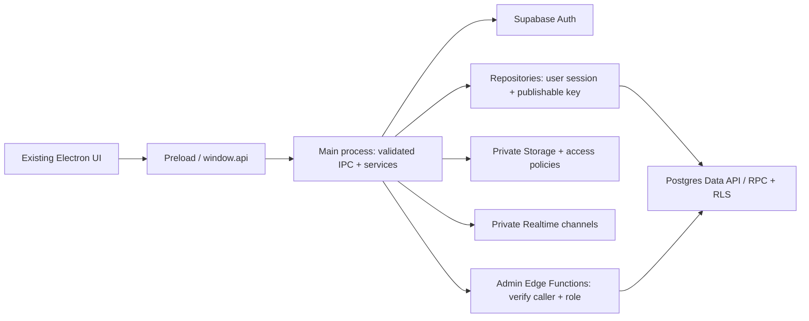

# RUNO HRS MIS - Supabase Integration Roadmap

Date: 2026-09-13 | Status: Planning only; integration/deployment abhi start nahi hua.
Goal: Multiple Windows PCs par same authorized business data, centralized login, shared files aur live updates.
Scope: Existing Electron UI, fonts, tables, filters aur legends preserve karke data/auth layer migrate karna.
Planning baseline: One RUNO organization, multiple departments/workstations, Supabase Cloud, online writes.

## 1. Current application se kya migrate karna hai

| Current source | Finding | Roadmap action |
| --- | --- | --- |
| `db/storage.js`, `db/index.js` | Per-PC `userData/runo_mis_database.json`; startup seed/schema repair | Export original data first; cloud mode mein automatic sample/admin creation disable |
| `db/repositories/*.js` | Customers, projects, manufacturing, approvals, accounts, store local arrays use karte hain | Same domain interfaces ke asynchronous Supabase repositories |
| `db/index.js` purchase methods | Purchase requests coordinator ke andar hain | Separate purchase repository; existing request/response mapping preserve |
| `src/js/views/designView.js` | `runo_design_projects` localStorage aur JSON workflows separate sources hain | Dono export, reconcile, then one shared design workflow model |
| Assembly, Service, Vendor, Costing partials | Kuch rows/actions abhi sample/placeholder hain | Real create/edit/save workflows banana bhi scope hai; database connection alone enough nahi |
| `ipc/authHandlers.js`, `userRepo.js`, `src/js/auth.js` | Local passwords, limited handler authorization, unknown-role ADMIN fallback | Supabase Auth, verified membership, server-enforced permissions, default deny |
| `preload.js`, `ipc/*Handlers.js` | UI already `window.api` bridge use karti hai | Bridge retain; validation, async handling, typed error mapping add |

Existing [Central Database Blueprint](CENTRAL_DATABASE_BLUEPRINT.md) conceptual reference hai.
Is roadmap ke Auth, key handling, offline, migration aur release decisions ko implementation baseline samjhein.
Us blueprint ka custom `users.password_hash` schema aur completed checkboxes implementation proof nahi hain.

## 2. Architecture aur fixed design decisions



- Distributed Electron main process bhi client hai: URL + publishable key allowed; secret/service-role key aur DB password EXE, preload, renderer ya shipped `.env` mein kabhi nahi. [API keys](https://supabase.com/docs/guides/getting-started/api-keys)
- Supabase Auth identities handle karega; public `profiles` mein password/password hash nahi. [User data](https://supabase.com/docs/guides/auth/managing-user-data)
- Protected application tables par organization membership + approval + permitted action enforce honge; grants aur RLS dono configure honge. [RLS](https://supabase.com/docs/guides/database/postgres/row-level-security)
- V1 online writes karega. Connection fail hone par local JSON mein silently save/fallback nahi hoga; clear retry message aur unsaved form retain hoga.
- Dev, staging aur production separate honge. Versioned SQL migrations; test/demo seeds sirf isolated environments mein. [Migrations](https://supabase.com/docs/guides/local-development/database-migrations)
- `window.api` return contracts preserve karne ke liye mapping layer rakhein; SDK objects directly views ko return na karein.
- Financial fields alag protected tables mein rakhein: row access milne ka matlab har sensitive column ka access nahi hona chahiye.

## 3. Structured folder plan

All paths below `runo HRS/` ke relative hain. New implementation files normally 100-200 lines ke focused modules hon.

```text
config/                         # Public runtime config + validation
services/auth/                  # Login, session storage, approval checks
services/domain/                # Multi-step business operations
services/realtime/              # Subscription lifecycle + authorized refetch
services/files/                 # Upload/download orchestration
db/adapters/                    # Explicit local-test or Supabase adapter
db/repositories/supabase/        # Customer/project/design/etc. repositories
db/mappers/                     # Legacy IDs, dates, status and response mapping
ipc/                            # Existing handlers, split by responsibility
supabase/migrations/            # Ordered schema, grants, RLS, RPC, indexes
supabase/functions/             # Verified administrator operations
supabase/tests/                 # Database constraints and permission tests
scripts/migration/              # Inventory, export, validate, import, reconcile
tests/integration/supabase/      # Real database contracts in isolation
docs/features/supabase/          # Phase notes and deployment/restore runbooks
```

Config contract: `RUNO_DATA_BACKEND=local|supabase`, `SUPABASE_URL`, `SUPABASE_PUBLISHABLE_KEY`.
Select backend explicitly at startup; cloud build must fail clearly on missing config.
Future server/migration credentials go in deployment secrets, never desktop config or migration reports.

## 4. Proposed data model

Exact columns Phase 0 inventory se finalize honge; neeche domain boundaries hain, executable DDL nahi.

| Current data / domain | Proposed tables |
| --- | --- |
| Local users + departments | `auth.users`, `profiles`, `organizations`, `organization_memberships`, `departments` |
| Customers + external vendor records | `customers`, `vendors`, `contacts` |
| Project master + design localStorage/workflows | `projects`, `project_specs`, `design_jobs`, `design_stages`, `design_time_entries` |
| Sales, quotes, PO tracking, costing | `quotations`, `quotation_items`, `sales_orders`, `cost_estimates`, `cost_estimate_items` |
| Purchase requests + procurement | `purchase_requests`, `purchase_request_items`, `purchase_orders`, `purchase_order_items` |
| Manufacturing + Assembly & Testing | `manufacturing_jobs`, `manufacturing_stages`, `assembly_jobs`, `test_results` |
| Service/support | `service_tickets`, `service_visits` |
| storeItems/storeTransactions | `inventory_items`, `warehouses`, `stock_movements` |
| accountEntries | `ledger_accounts`, `vouchers`, `voucher_lines`; legacy entries require explicit mapping |
| Approvals, history, attachments | `approvals`, `audit_events`, `documents` + private Storage objects |
| Migration traceability | `migration_runs`, `legacy_id_map`, rejected-record reports |

Conventions: UUID primary keys; organization scope; foreign keys; server timestamps; `created_by`; integer `version`.
Money/quantity use precise numeric columns; currency separate; timestamps UTC, UI Asia/Kolkata; date-only fields use SQL date.
Keep project/PR numbers readable, unique per organization/financial year; generate atomically server-side, never client `count + 1`.
Canonical status codes stored in DB; mappers preserve current labels/legend colors. Archive referenced records; avoid cascading business-history deletion.
Create indexes for organization, foreign keys, status, dates and actual search/filter patterns; paginate/sort/filter on server.

## 5. Execution phases and completion gates

Effort is an initial estimate for one dedicated developer; each next phase depends on the previous gate.

| Phase | Work / deliverables | Gate to move forward | Estimate |
| --- | --- | --- | --- |
| 0 - Inventory | Every PC's JSON, Design localStorage, files, roles, module gaps and source counts; field/status map | Business owner identifies authoritative records, duplicates, demo data and scope | 2-3 days |
| 1 - Foundation | Dev/staging projects, pinned SDK/runtime compatibility, config loader, adapter contracts, migrations, base schema | Fresh local/staging database reproducible; desktop package includes required modules/config | 2-3 days |
| 2 - Identity & access | Auth, profiles/memberships, invites, approval/rejection/revocation, RLS, administrator functions | Pending/unknown role cannot access business data; cross-role/organization denial tests pass | 4-6 days |
| 3 - First working slice | Customers + Projects create/read/edit/archive, search, paging, server project numbering | PC A creates, PC B reads; restart retains data; simultaneous edits handled | 4-6 days |
| 4 - Business modules | Design -> Sales/Commercial -> Purchase -> Manufacturing -> Assembly/Service -> Store/Accounts; vendor/costing workflows | Each module's real save/reopen/edit/export flow passes; transactions reconcile | 6-10 days |
| 5 - Files & updates | Private file buckets, metadata/revisions, authorized live refresh, audit events | Allowed users share drawings; denied users cannot download; reconnect refreshes correctly | 3-5 days |
| 6 - Migration rehearsal | Read-only export, normalization, ID mapping, staging imports, rejects, repeated reconciliation | Counts, links, stock/account totals and attachment checksums approved; rerun has no duplicates | 3-5 days |
| 7 - QA & pilot | Full tests, packaged EXEs, 2-3 real workstations, backup/restore rehearsal, owner training | Pilot checklist signed off; no unresolved data-loss or permission failures | 3-5 days |
| 8 - Cutover | Freeze old writers, final export/import, reconcile, switch all workstations, monitor | Shared production data verified; support and rollback runbooks ready | 1-2 days |
| Later - Offline writes | Durable outbox, cache permissions, conflict resolution, retries and reconciliation | Disconnect/reconnect/crash/conflict tests pass before shop-floor rollout | Separate estimate |

Total planning range: 28-45 developer days, roughly 6-9 working weeks, subject to data quality and placeholder-workflow scope.
First usable milestone is Phase 3. Full offline editing and new accounting requirements can extend the schedule.

## 6. Login, roles and authorization

- Recommended login: verified email + password; retain username as display/business alias. Supabase password login supports email or phone. [Password Auth](https://supabase.com/docs/guides/auth/passwords)
- Before Phase 2, decide whether username sign-in is mandatory. If yes, design a rate-limited server-mediated alias flow; do not expose a public username/email directory.
- Existing plaintext/default passwords migrate nahi honge. Invite/reset flow use karein, correct email ownership verify karein, SMTP and packaged-app reset links test karein.
- Admin can invite, approve, reject, suspend and assign membership roles through authenticated server operations. Verify caller identity and current admin membership before elevated work. [Edge Function auth](https://supabase.com/docs/guides/functions/auth)
- A pending user may read their own approval/profile state; protected business tables remain denied. Users cannot modify their own role, organization or approval status.
- Bootstrap first admin by a reviewed Auth UUID; remove username-based automatic ADMIN/ANAND grants and seed-password fallbacks in cloud mode.
- Store application role/approval in protected membership rows; never trust renderer-supplied role or user-editable metadata. Apply the same checks to RPC, exports and file access.
- Suggested access: Sales/Commercial manage customer/project/commercial fields; Design manages design stages; Manufacturing/Assembly manage execution/testing; Store/Purchase manage inventory/procurement; Accounts manages vouchers.
- Service manages tickets; Admin manages users and configuration. ENGINEER/OPERATOR need explicit scoped capabilities; CUSTOMER/VENDOR access stays disabled until row ownership is modeled and tested.
- Session refresh lives in main process; renderer gets only safe user data. Persist refresh tokens using a supported OS-backed Electron `safeStorage` API, never plaintext/localStorage; clear on logout. [safeStorage](https://www.electronjs.org/docs/latest/api/safe-storage)
- Revoked membership must deny new data requests even with an unexpired token. Unsubscribe live channels and clear user caches on logout/role change.
- Validate IPC sender and payloads; check affected row counts; return useful validation/conflict/network errors without leaking tokens or passwords.

## 7. Data migration runbook

1. List every workstation/data path. Copy original JSON, Design localStorage export and attachments before opening any importer that could run seed repair.
2. Tag each export with source machine, timestamp and checksum; store snapshots in a restricted backup location. Separate approved business records from demo/default records.
3. Audit duplicate emails/customer names/project numbers, missing relations, unsupported statuses, malformed dates, amount formats and files that exist only on one PC.
4. Build repeatable `(source_machine, entity, legacy_id) -> UUID` mappings. Resolve cross-machine conflicts explicitly; never merge by display name alone.
5. Normalize JSON and localStorage records into staging rows; reconcile Design states against existing project workflows. Ambiguous dates/amounts become rejected records, not guessed values.
6. Provision verified Auth identities and memberships; then customers/vendors -> projects/specs -> workflows/orders/jobs -> inventory/accounts -> approvals/documents.
7. Import in restartable batches; transactions protect related rows. Record migration run IDs and idempotency keys; reruns must neither duplicate nor overwrite newer cloud edits.
8. Upload actual file bytes with checksum/size verification; store bucket/object paths in `documents`. Report missing files for resolution.
9. Reconcile entity counts, duplicate keys, foreign-key integrity, status totals, stock balances, voucher totals and attachment checksums; business owner reviews exceptions.
10. Rehearse the same process in staging. At final cutover freeze all legacy writers, take fresh snapshots and repeat the approved import and checks.
11. Preserve original backups through the agreed retention period; protect legacy password-bearing snapshots and remove them securely when retention ends.

## 8. Concurrency, files, realtime and offline behavior

- Important mutations use database transactions/RPC: project + number allocation, stage transition + audit, purchase receipt + stock movement, voucher posting.
- Use expected `version` on updates; stale edits show conflict/reload choices. Unique operation IDs make retries safe after timeout/crash; never overwrite whole database snapshots.
- Private Storage buckets for drawings, purchase documents and service reports; access mirrors project/department permissions. Signed links expire; DB stores paths rather than temporary URLs. [Private buckets](https://supabase.com/docs/guides/storage/buckets/fundamentals)
- Add upload size/type rules, revision history and failed-upload cleanup; database metadata and file upload are separate operations with recovery steps.
- Use private Broadcast topics scoped to organization/project, explicit channel authorization and minimal change payloads; refetch authorized rows after events. [Realtime choices](https://supabase.com/docs/guides/realtime/subscribing-to-database-changes)
- Reconnect/startup refetches authoritative data and refreshes aggregates; subscriptions do not replace reconciliation or implement offline synchronization.
- V1 permits no offline posting/approval. If a read cache is added, mark it stale, scope it per user, and define expiry/revocation behavior.
- Later offline phase needs a durable local outbox, local UUIDs, server idempotency, version conflicts, deletion handling, retry backoff and reconciliation; approvals/stock/account posting stay server-validated.

## 9. Verification, release and recovery

- [ ] Repositories preserve current IPC contracts; validation failures do not display success or clear unsaved forms.
- [ ] All roles tested for SELECT/INSERT/UPDATE/DELETE, RPC and export access; anon, pending, revoked, self-promotion and cross-organization attempts denied.
- [ ] Login/logout, expired sessions, reconnect, invitation/reset links and app restart tested on packaged Windows EXEs.
- [ ] Simultaneous project-number creation, conflicting edits and repeated requests produce no duplicate records or silent lost updates.
- [ ] Every module has real create/save/reopen/edit/search/page/export checks, including Assembly, Service, Vendor and Costing.
- [ ] Store balances and voucher debits/credits reconcile; posted entries use controlled reversals and immutable audit history.
- [ ] Private file access, revisions, expired links, failed uploads and missing legacy attachments covered.
- [ ] Local/staging tests use disposable data; production cannot run sample reset/clear endpoints or automatic seed insertion.
- [ ] Representative production-size pagination and two-PC live-update behavior measured against agreed response-time targets.
- [ ] Package scan confirms no secret/service-role keys, DB passwords, migration dumps, fixture credentials or refresh tokens are shipped.

Choose backup retention and RPO/RTO before release; verify available features/costs for the selected plan.
Database backups do not include Storage file bytes: schedule separate object backups and restore both in rehearsal. [Backups](https://supabase.com/docs/guides/platform/backups)
Pilot with named Admin/Sales/Design/operations owners; collect failed writes, permission errors, latency and reconciliation results.
Before cloud writes start, rollback may restore the untouched local snapshot after stopping migration.
After cloud writes start, stop writes and preserve/export the cloud delta; prefer rolling back the app against compatible cloud schema.
Do not simply flip PCs back to stale JSON: reconcile post-cutover records first and restore all workstations to one authoritative state.

## 10. Inputs needed before implementation

- RUNO-owned Supabase organization/project access, hosting region, budget, expected users/PCs, concurrent usage and file/data sizes.
- Verified user emails, first admin identity, department/action permission matrix and whether external customer/vendor access is required.
- Internet reliability, acceptable outage behavior, agreed backup retention/RPO/RTO and maintenance window.
- Authoritative workstation exports, attachment locations, demo-data exclusions and module owners for reconciliation.
- First implementation task: Phase 0 inventory + migration mapping report; then staging foundation and Auth. This document creates no cloud resources or credentials.
