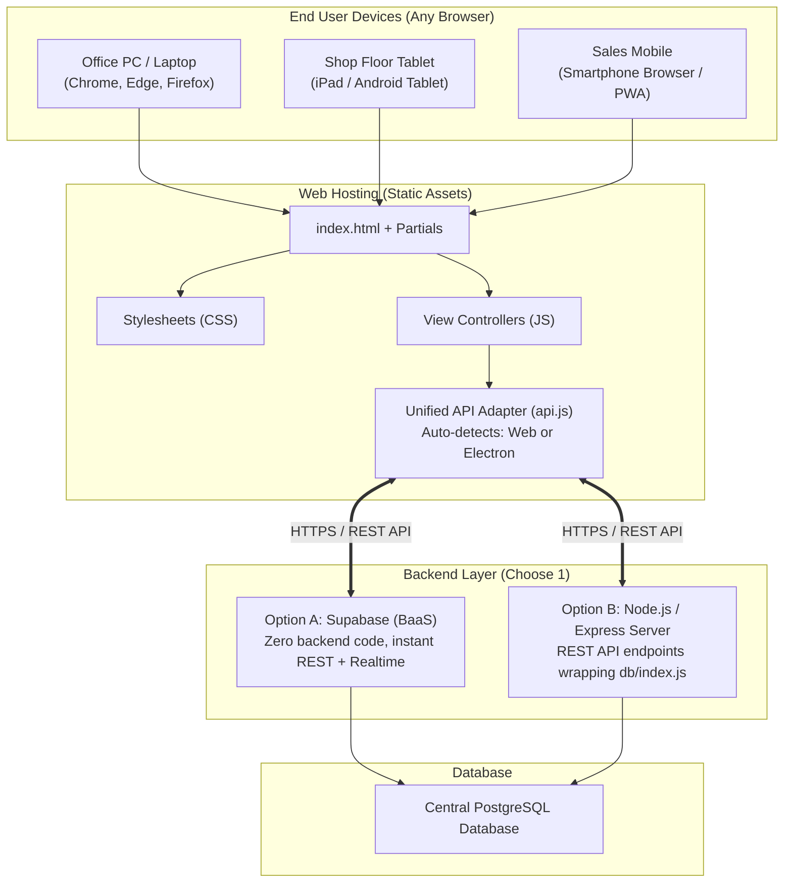

# RUNO HRS INDIA - Web Application Conversion Blueprint

**Document Version:** 1.0.0  
**Target:** Converting Desktop Application (Electron) into a Web Application (Browser / Cloud / Intranet)  
**Strategy:** "Write Once, Run Everywhere" (Unified Codebase for Desktop .exe + Web Portal)  
**Date:** September 2026  

---

## 1. Executive Summary

Aapka RUNO HRS application already **100% Web Standards (HTML5, Vanilla CSS3, JavaScript)** par bana hua hai.
- Isme koi bhi native desktop UI toolkit (jaise C# WinForms, WPF ya Qt) use nahi hui hai.
- Saara UI browser DOM par render hota hai.

**Iska sabse bada advantage ye hai ki:**
Application ka **90% code (HTML partials, CSS design system, View controllers, forms, date filters, tables) EXACT SAME** rahega! Sirf 10% connection layer (jo abhi Electron IPC `window.api` hai) ko Web HTTP/REST ya Supabase client se replace karna hoga.

---

## 2. Desktop vs Website: Kya Badlega aur Kya Same Rahega?

| Component | Electron Desktop App (Abhi) | Web Application (Future) | Code Change? |
| :--- | :--- | :--- | :--- |
| **HTML UI Partials** | `src/partials/*.html` | Same `src/partials/*.html` | **0% Change** (Exact Same) |
| **Design & CSS** | `src/css/*.css` (Dark theme, chips, tables) | Same `src/css/*.css` | **0% Change** (Exact Same) |
| **View Controllers** | `projectsView.js`, `mfgView.js`, etc. | Same View scripts | **0% Change** (Exact Same) |
| **Date Filters & Logic** | `dateUtils.js`, `utils.js` | Same utilities | **0% Change** (Exact Same) |
| **API Bridge Layer** | `preload.js` (`ipcRenderer.invoke`) | `src/js/api.js` (`fetch()` ya Supabase SDK) | **Replaced** (10% work) |
| **Backend & Database** | Local Node.js + `runo_mis_database.json` | Cloud Node.js API ya Central Supabase/Postgres | **Centralized** |
| **Distribution** | `.exe` installer (Windows) | URL (e.g. `https://mis.runohrs.com` ya LAN IP) | **Browser Access** |

---

## 3. Architecture Blueprint for Web



---

## 4. The Magic Bridge: Unified `api.js` (Desktop + Web Both)

Hum ek universal `api.js` file banate hain jo check karegi ki user Desktop app me hai ya Web browser me:

```javascript
// src/js/api.js
// Auto-detect environment: Electron Desktop vs Web Browser

const isElectron = typeof window.process !== 'undefined' && window.process.type === 'renderer';

const API_BASE_URL = window.location.origin.includes('localhost') 
  ? 'http://localhost:5000/api' 
  : 'https://mis-api.runohrs.com/api';

window.api = {
  // 1. Projects
  getProjects: async (filters = {}) => {
    if (isElectron && window.electronApi) {
      return window.electronApi.getProjects(filters); // Electron IPC
    }
    // Web Browser Fetch Call
    const params = new URLSearchParams(filters).toString();
    const res = await fetch(`${API_BASE_URL}/projects?${params}`, {
      headers: { 'Authorization': `Bearer ${localStorage.getItem('runo_token')}` }
    });
    return res.json();
  },

  createProject: async (projectData) => {
    if (isElectron && window.electronApi) {
      return window.electronApi.createProject(projectData);
    }
    const res = await fetch(`${API_BASE_URL}/projects`, {
      method: 'POST',
      headers: { 
        'Content-Type': 'application/json',
        'Authorization': `Bearer ${localStorage.getItem('runo_token')}`
      },
      body: JSON.stringify(projectData)
    });
    return res.json();
  },

  // 2. Authentication
  login: async (username, password) => {
    if (isElectron && window.electronApi) {
      return window.electronApi.login(username, password);
    }
    const res = await fetch(`${API_BASE_URL}/auth/login`, {
      method: 'POST',
      headers: { 'Content-Type': 'application/json' },
      body: JSON.stringify({ username, password })
    });
    const data = await res.json();
    if (data.token) {
      localStorage.setItem('runo_token', data.token);
      localStorage.setItem('runo_user', JSON.stringify(data.user));
    }
    return data;
  }
};
```

---

## 5. Web Conversion: 3 Best Options

### Option 1: Supabase Direct Integration (Fastest & Recommended)
- **Kaise Kaam Karega:** Frontend me direct `@supabase/supabase-js` library load hoti hai.
- **Backend Coding:** **0%**. Supabase har PostgreSQL table ke liye automatically secure REST API aur Realtime WebSocket endpoints de deta hai.
- **Cost:** Free tier par 500MB database aur hazaron users free me chal sakte hain.

### Option 2: Express / Node.js API Server
- **Kaise Kaam Karega:** Ek chota `server.js` banaya jata hai jo aapke current `db/index.js` ko REST endpoints me expose karta hai:
  - `GET /api/projects`
  - `POST /api/projects`
  - `GET /api/customers`
  - `POST /api/auth/login`
- **Faayda:** Company ke apne physical server / local network (LAN) par bina cloud ke bhi host kiya ja sakta hai.

### Option 3: Progressive Web App (PWA)
- **Kaise Kaam Karega:** Browser me `manifest.json` aur `service-worker.js` add karte hain.
- **Faayda:** 
  - Chrome me "Install App" ka button aa jata hai.
  - Workers ke mobile / tablet par bina Play Store ke app icon create ho jata hai.
  - Offline cache bhi support karta hai.

---

## 6. Hosting & Deployment Roadmap (Web Me Live Karne Ke Steps)

1. **Domain Name & SSL Setup:**
   - e.g. `https://mis.runohrs.com` (Cloudflare se free SSL certificate).
2. **Frontend Hosting (1-Click Free Hosting):**
   - Vercel, Netlify, ya AWS S3 + CloudFront (Static files direct serve hoti hain, speed ultra-fast hoti hai).
3. **Backend / Database Hosting:**
   - Supabase Cloud (Singapore / Mumbai AWS region for fastest Indian latency) ya Company Office me ek dedicated Linux mini PC / Server.
4. **Access Control & Security:**
   - HTTPS / SSL mandatory encryption.
   - JWT tokens for session security.
   - Admin approval toggle (Jaise abhi ANAND approve karta hai naye users ko).

---

## 7. Timeline & Effort Estimate

| Step | Task | Duration | Effort |
| :--- | :--- | :--- | :--- |
| **Step 1** | Central DB Schema (Supabase/PostgreSQL) execute karna | 1 Din | Kam |
| **Step 2** | `window.api` ko Web `fetch` / Supabase client me map karna | 1-2 Din | Medium |
| **Step 3** | Responsive touches (Mobile/Tablet par table scroll & header check) | 1 Din | Kam |
| **Step 4** | Web server / Vercel / Cloudflare par deploy karna | Half Day | Kam |
| **Total** | **Desktop to Complete Web Portal** | **~3 Se 4 Din** | **Bohat Aasaan** |
